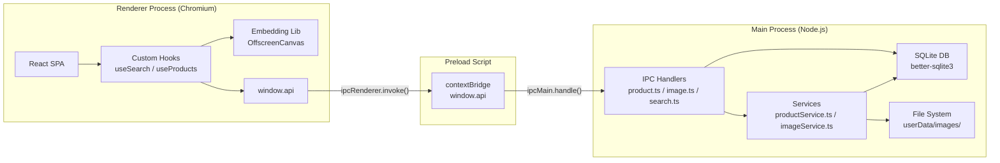
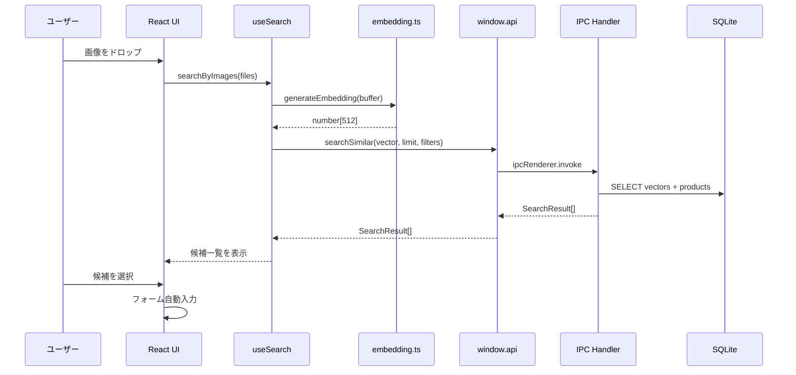
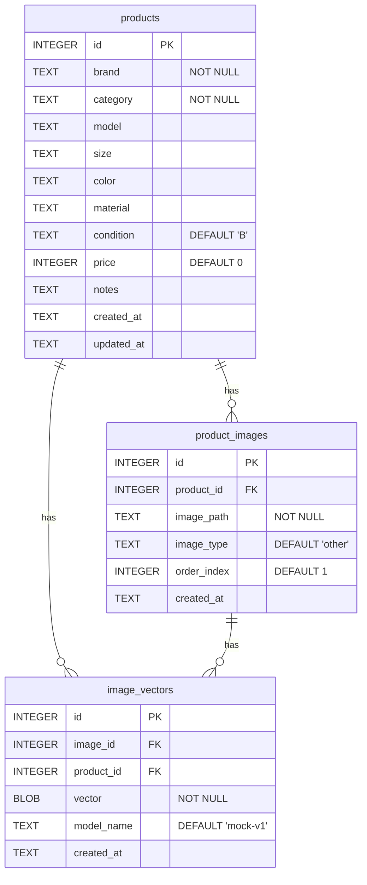
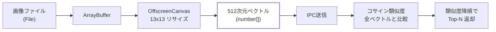
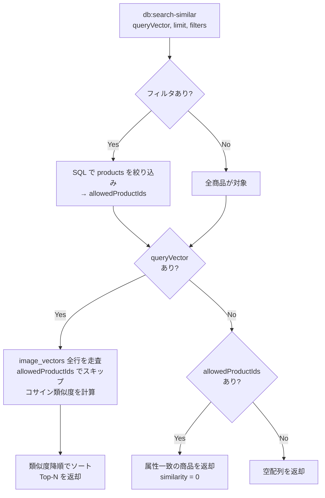
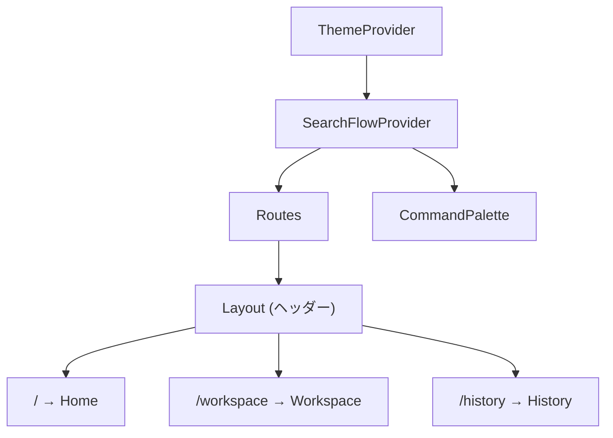
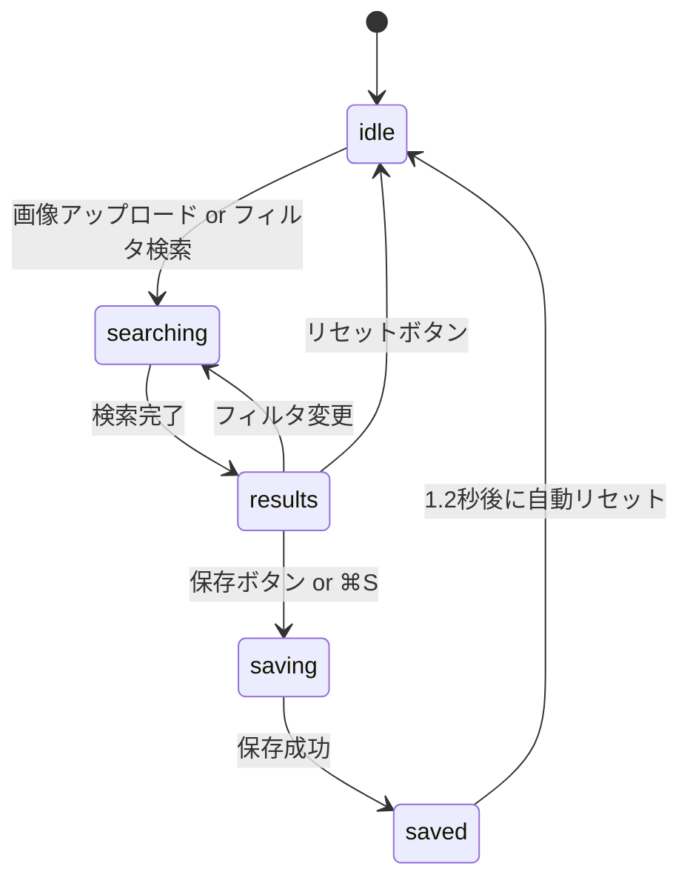
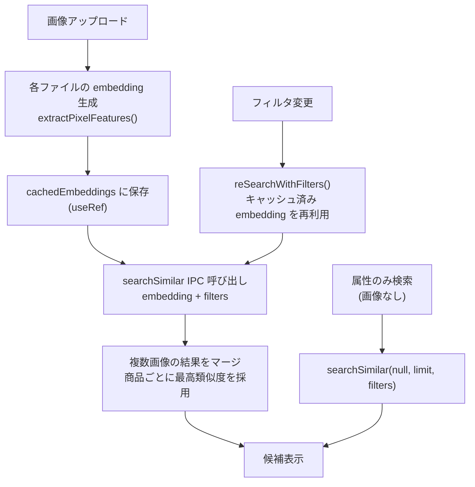
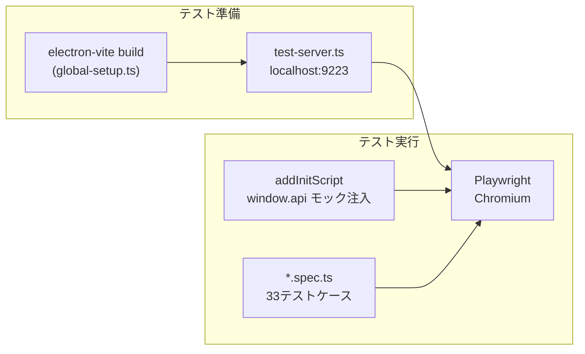

# SS Image Search アーキテクチャドキュメント

> 中古アパレル買取向け画像類似検索デスクトップアプリケーション

対象読者: JavaScript/TypeScript エンジニア

---

## 目次

1. [プロジェクト概要と技術スタック](#1-プロジェクト概要と技術スタック)
2. [ディレクトリ構造とファイルマップ](#2-ディレクトリ構造とファイルマップ)
3. [アーキテクチャ全体像](#3-アーキテクチャ全体像)
4. [データモデルとデータベース](#4-データモデルとデータベース)
5. [画像類似検索パイプライン](#5-画像類似検索パイプライン)
6. [フロントエンド構成](#6-フロントエンド構成)
7. [IPC チャネル仕様](#7-ipc-チャネル仕様)
8. [テストアーキテクチャ](#8-テストアーキテクチャ)

---

## 1. プロジェクト概要と技術スタック

### 目的

中古ブランド品の買取業務において、商品写真をアップロードするだけで過去の類似商品を自動検索し、ブランド名・カテゴリ・価格などのフォーム入力を省力化するデスクトップアプリケーション。本番の画像認識 AI（将来的に接続予定）の代わりに、ピクセルベースのモック embedding で類似度計算を行う。

### 技術スタック

| レイヤー | 技術 | 役割 |
|---|---|---|
| デスクトップフレームワーク | Electron 33 | ネイティブウィンドウ管理、ファイルシステムアクセス |
| ビルドツール | electron-vite 2 + Vite 5 | Main/Preload/Renderer の3ターゲットビルド |
| フロントエンド | React 18 + TypeScript 5 | SPA UI |
| ルーティング | React Router 6 (HashRouter) | クライアントサイドルーティング |
| スタイリング | Tailwind CSS 3 + CSS変数 | ダークモード対応テーマシステム |
| データベース | better-sqlite3 | ローカル SQLite（WAL モード） |
| テスト | Playwright | E2E テスト（33ケース） |
| CI | GitHub Actions | macOS 上でのE2Eテスト自動実行 |

### ビルド構成

electron-vite は1つの設定ファイル（`electron.vite.config.ts`）から3つの独立したバンドルを生成する:

| ターゲット | エントリー | 出力先 | 実行環境 |
|---|---|---|---|
| **Main** | `src/main/index.ts` | `out/main/index.js` | Node.js（メインプロセス） |
| **Preload** | `src/preload/index.ts` | `out/preload/index.js` | Node.js（制限付きサンドボックス） |
| **Renderer** | `src/renderer/index.html` | `out/renderer/` | Chromium（ブラウザ環境） |

3ターゲットすべてで `@shared` パスエイリアスが有効になっており、`src/shared/` 内の型定義とユーティリティを Main と Renderer の双方からインポートできる。

---

## 2. ディレクトリ構造とファイルマップ

```
SSImageSearch/
├── src/
│   ├── main/                          # Electron メインプロセス (Node.js)
│   │   ├── index.ts                   #   アプリ起動・ウィンドウ作成
│   │   ├── db/
│   │   │   ├── connection.ts          #   SQLite 接続シングルトン
│   │   │   ├── schema.ts             #   テーブル・インデックス定義
│   │   │   └── seed.ts               #   30商品のサンプルデータ投入
│   │   ├── ipc/
│   │   │   ├── product.ts            #   商品 CRUD の IPC ハンドラー
│   │   │   ├── image.ts              #   画像保存・読取の IPC ハンドラー
│   │   │   └── search.ts             #   ベクトル検索 + 属性フィルタの IPC ハンドラー
│   │   └── services/
│   │       ├── productService.ts      #   商品の DB 操作ロジック
│   │       └── imageService.ts        #   画像ファイルの読み書きロジック
│   │
│   ├── preload/
│   │   └── index.ts                   # contextBridge で window.api を公開
│   │
│   ├── renderer/
│   │   ├── index.html                 #   HTML エントリー
│   │   └── src/
│   │       ├── main.tsx               #   React マウント
│   │       ├── App.tsx                #   ルーティング + プロバイダー
│   │       ├── env.d.ts               #   window.api 型定義
│   │       ├── routes/
│   │       │   ├── Home.tsx           #     ダッシュボード
│   │       │   ├── Workspace.tsx      #     買取登録（3ペインレイアウト）
│   │       │   └── History.tsx        #     買取履歴一覧
│   │       ├── components/
│   │       │   ├── Layout.tsx         #     共通ヘッダー + Outlet
│   │       │   ├── CommandPalette.tsx  #     ⌘K コマンドパレット
│   │       │   ├── CandidateCard.tsx  #     候補カード（グリッド用）
│   │       │   ├── ImageSlot.tsx      #     画像スロット
│   │       │   ├── ProductForm.tsx    #     商品フォーム（再利用可能）
│   │       │   ├── SimilarityBar.tsx  #     類似度バー
│   │       │   └── ConfidenceBadge.tsx #    信頼度バッジ
│   │       ├── contexts/
│   │       │   ├── ThemeContext.tsx    #     ライト/ダーク/システムテーマ管理
│   │       │   └── SearchFlowContext.tsx #   検索フロー状態管理
│   │       ├── hooks/
│   │       │   ├── useSearch.ts       #     画像検索 + embeddingキャッシュ
│   │       │   ├── useProducts.ts     #     商品データ取得
│   │       │   ├── useImages.ts       #     画像ローダー
│   │       │   └── useKeyboard.ts     #     グローバルショートカット
│   │       ├── lib/
│   │       │   ├── embedding.ts       #     画像→512次元ベクトル生成
│   │       │   ├── similarity.ts      #     コサイン類似度・ハッシュ
│   │       │   └── recommend.ts       #     候補からの推奨値生成
│   │       └── styles/
│   │           └── globals.css        #     Tailwind + テーマ CSS 変数
│   │
│   └── shared/                        # Main/Renderer 共有
│       ├── types.ts                   #   全インターフェース・定数
│       └── vectors.ts                 #   ベクトル演算・直列化
│
├── tests/
│   └── e2e/
│       ├── electron-test.ts           #   Playwright カスタムフィクスチャ
│       ├── test-server.ts             #   テスト用 HTTP サーバー
│       ├── global-setup.ts            #   テスト前ビルド
│       ├── home.spec.ts               #   Home 画面テスト
│       ├── workspace-primary.spec.ts  #   Workspace 主要フロー
│       ├── workspace-edge.spec.ts     #   Workspace エッジケース
│       ├── history.spec.ts            #   History 基本テスト
│       ├── history-edge.spec.ts       #   History フィルタ・ページネーション
│       └── keyboard.spec.ts           #   キーボードショートカット
│
├── electron.vite.config.ts            # ビルド設定
├── tailwind.config.js                 # Tailwind 設定
├── playwright.config.ts               # E2E テスト設定
├── package.json
├── tsconfig.json                      # プロジェクト参照ルート
├── tsconfig.node.json                 # Main + Preload + Shared 用
└── tsconfig.web.json                  # Renderer + Shared 用
```

---

## 3. アーキテクチャ全体像

### Electron の3プロセスモデル

Electron アプリは以下の3つの独立した実行コンテキストで構成される:



**セキュリティモデル:** Renderer は `contextIsolation: true` / `nodeIntegration: false` で動作する。Node.js API への直接アクセスはなく、Preload スクリプトが `contextBridge.exposeInMainWorld` で公開した `window.api` オブジェクトのみを通じて Main プロセスと通信する。

### レイヤー間のデータフロー



---

## 4. データモデルとデータベース

### テーブル構成

3つのテーブルが外部キーで連携し、CASCADE 削除で整合性を維持する。



**インデックス:** `product_images.product_id`, `image_vectors.product_id`, `image_vectors.image_id` にそれぞれインデックスが張られている。

### データベース接続管理

`src/main/db/connection.ts` がシングルトンパターンで SQLite 接続を管理する:

```typescript
// connection.ts の核心部分
let db: Database.Database | null = null

export function getDatabase(): Database.Database {
  if (!db) {
    const dbPath = path.join(app.getPath('userData'), 'ssimagesearch.db')
    db = new Database(dbPath)
    db.pragma('journal_mode = WAL')   // 読み書き並行性を改善
    db.pragma('foreign_keys = ON')    // 外部キー制約を強制
  }
  return db
}
```

- **WAL モード**: Write-Ahead Logging により、読み取りと書き込みを同時に実行可能
- **外部キー制約**: `ON` にすることで `image_vectors.image_id` が存在しない `product_images.id` を参照した場合にエラーになる。これにより不正なベクトル挿入を防止する
- **遅延初期化**: `getDatabase()` を初めて呼んだ時点でファイルが作成される

### シードデータ

`src/main/db/seed.ts` がアプリ起動時に初期データを投入する。6ブランド x 5カテゴリ = 30商品で、各商品に2枚のプレースホルダー SVG 画像と対応するベクトルが生成される。

**バージョン管理メカニズム:** `SEED_MODEL` 定数（現在 `mock-v4`）で embedding アルゴリズムのバージョンを追跡する。起動時に `image_vectors` テーブルに該当バージョンのレコードが存在しない場合、全データをクリアして再シードする。アルゴリズム変更時はこのバージョンを上げるだけで自動的にデータが更新される。

```typescript
// seed.ts のバージョンチェック部分
const SEED_MODEL = 'mock-v4'

export function seedDatabase(): void {
  const db = getDatabase()
  const hasCurrentVersion = db
    .prepare('SELECT COUNT(*) as cnt FROM image_vectors WHERE model_name = ?')
    .get(SEED_MODEL) as { cnt: number }

  if (hasCurrentVersion.cnt > 0) return  // 既にシード済み

  // 古いデータをすべて削除して再投入
  db.prepare('DELETE FROM image_vectors').run()
  db.prepare('DELETE FROM product_images').run()
  db.prepare('DELETE FROM products').run()
  // ... トランザクション内で30商品を一括挿入
}
```

---

## 5. 画像類似検索パイプライン

このアプリのコア機能は「画像を入力として類似商品を見つける」ことにある。以下のパイプラインで実現される。

### 5.1 全体フロー



### 5.2 Embedding 生成（Renderer 側）

`src/renderer/src/lib/embedding.ts` が画像データから 512 次元の特徴ベクトルを生成する。

**ベクトルレイアウト (512次元):**

| インデックス | 内容 | 次元数 |
|---|---|---|
| 0 ~ 506 | 13x13 ピクセルグリッドの RGB 値（各 [-1, 1] に正規化） | 507 (169 x 3) |
| 507 ~ 509 | 全ピクセルの R/G/B 平均値 | 3 |
| 510 ~ 511 | R/G チャネルの標準偏差（コントラスト指標） | 2 |

**処理ステップ:**

1. **画像データ → Blob → ImageBitmap**: `createImageBitmap()` でブラウザのネイティブデコーダーを使用
2. **13x13 リサイズ**: `OffscreenCanvas` に `drawImage()` で描画。これにより解像度・アスペクト比が統一される
3. **ピクセル値の正規化**: 各チャネルを `value / 128 - 1` で [-1, 1] の範囲に変換
4. **統計量の追加**: 平均 RGB と標準偏差を末尾に追加
5. **L2 正規化**: ベクトル全体を単位長に正規化。これによりコサイン類似度がドット積で計算可能になる

```typescript
// embedding.ts の核心ロジック
async function extractPixelFeatures(imageData: ArrayBuffer): Promise<number[]> {
  const blob = new Blob([imageData])
  const bitmap = await createImageBitmap(blob)

  const canvas = new OffscreenCanvas(GRID, GRID)  // GRID = 13
  const ctx = canvas.getContext('2d')!
  ctx.drawImage(bitmap, 0, 0, GRID, GRID)

  const { data } = ctx.getImageData(0, 0, GRID, GRID)
  const features: number[] = []
  // ... 169ピクセル × RGB → 507 要素 + 統計量 5 要素 = 512 要素
  return normalize(features)
}
```

**フォールバック:** `OffscreenCanvas` が使えない環境（Node.js テスト等）では `hashFallback()` がファイルバイトのハッシュから決定論的なベクトルを生成する。これはコンテンツ非依存なので類似度検索には使えないが、クラッシュを防ぐ。

### 5.3 シードデータのベクトル生成（Main 側）

`src/shared/vectors.ts` の `generateProductVector()` がシードデータ用のベクトルを生成する。実画像がないシード商品に対して、**同じ 512 次元空間**に属するベクトルを合成する。

```typescript
// vectors.ts — 合成ピクセルの生成ロジック
export function generateProductVector(
  category: string, brand: string,
  brandColorHex: string, productSeed: number
): number[] {
  const base = hexToRgb(brandColorHex)        // ブランド固有色
  const hue = CATEGORY_HUE[category]          // カテゴリ色相バイアス
  const rng = seededRandom(productSeed)        // 商品固有のノイズ

  for (let i = 0; i < 169; i++) {
    // ブランド色 + カテゴリバイアス + テキスト模擬 + ノイズ → RGB
    // → /128 - 1 で [-1, 1] に正規化（embedding.ts と同じ式）
  }
  // 平均・分散も同じ手順で計算
  return normalize(features)
}
```

**設計意図:** シードデータはプレースホルダー SVG（ブランド色の背景 + テキスト）なので、`generateProductVector` はその SVG を Canvas で描画した場合と近い値を出力するよう設計されている。これにより、ユーザーがアップロードした実画像とシード商品のベクトルが意味のある類似度を持つ。

### 5.4 ハイブリッド検索（Main 側）

`src/main/ipc/search.ts` の `db:search-similar` ハンドラーが、ベクトル類似度と属性フィルターを組み合わせた検索を行う。



**検索の3モード:**

1. **画像 + フィルタ**: SQL でフィルタに一致する `productId` を取得 → その ID のベクトルのみとコサイン類似度を計算 → 類似度順にソート
2. **画像のみ**: 全ベクトルとコサイン類似度を計算（フィルタなし）
3. **フィルタのみ**: SQL で一致する商品を返却（類似度は 0）

### 5.5 ベクトルの直列化

ベクトル（`number[]`）は SQLite の BLOB カラムに保存する際に Float32Array へ変換される:

```typescript
// vectors.ts
export function vectorToBuffer(vec: number[]): Buffer {
  const float32 = new Float32Array(vec)
  return Buffer.from(float32.buffer)
}

export function bufferToVector(buf: Buffer): number[] {
  const float32 = new Float32Array(buf.buffer, buf.byteOffset, buf.byteLength / 4)
  return Array.from(float32)
}
```

512 次元 x 4 bytes = **2,048 bytes/ベクトル**。30商品 x 2画像 = 60ベクトルで約 120KB。

### 5.6 コサイン類似度

```typescript
export function cosineSimilarity(a: number[], b: number[]): number {
  let dot = 0, normA = 0, normB = 0
  for (let i = 0; i < a.length; i++) {
    dot += a[i] * b[i]
    normA += a[i] * a[i]
    normB += b[i] * b[i]
  }
  if (normA === 0 || normB === 0) return 0
  return dot / (Math.sqrt(normA) * Math.sqrt(normB))
}
```

ベクトルは L2 正規化済みなので `normA ≈ normB ≈ 1` であり、実質的にはドット積と等しい。値の範囲は -1（正反対）から 1（完全一致）。

---

## 6. フロントエンド構成

### 6.1 ルーティングとプロバイダー構成



`src/renderer/src/App.tsx` で以下の順にラップされる:

1. **ThemeProvider**: ライト/ダーク/システムテーマの管理。`localStorage` に永続化し、`<html>` 要素の `dark` クラスでトグル
2. **SearchFlowProvider**: 画像アップロード状態・検索結果・選択候補をルート間で共有
3. **Routes**: `HashRouter` による3ルート。`Layout` コンポーネントが共通ヘッダーを提供し、`<Outlet />` で子ルートを描画

### 6.2 テーマシステム

CSS 変数ベースのテーマシステムを採用:

```
globals.css                      tailwind.config.js
┌─────────────────────┐          ┌───────────────────────┐
│ :root {             │          │ colors: {             │
│   --surface-0:      │◀────────▶│   surface: {          │
│     255 255 255;    │          │     0: rgb(var(       │
│ }                   │          │       --surface-0)    │
│ .dark {             │          │       / <alpha>)      │
│   --surface-0:      │          │   }                   │
│     9 9 11;         │          │ }                     │
│ }                   │          │                       │
└─────────────────────┘          └───────────────────────┘
```

- CSS 変数はスペース区切りの RGB チャネル値（例: `255 255 255`）で定義
- Tailwind の `rgb(var(--name) / <alpha-value>)` 形式で参照し、不透明度修飾子（`bg-surface-0/50` など）に対応
- `ThemeContext` が `document.documentElement.classList.toggle('dark', ...)` でクラスを切り替え

### 6.3 Workspace: 3ペインレイアウト

買取登録の中心画面。3つのペインで構成される:

```
┌──────────────┬──────────────────────────────────┬──────────────────┐
│  左ペイン     │  中央ペイン                       │  右ペイン         │
│  w=260px     │  flex-1                          │  w=380px         │
│              │                                  │                  │
│  画像        │  候補一覧                          │  下書きフォーム    │
│  アップロード │  フィルタバー                      │                  │
│  (最大5枚)   │  リスト/グリッド切替               │  ブランド         │
│              │                                  │  カテゴリ         │
│  ドラッグ&   │  [GUCCI] [バッグ] [全色] [全素材]  │  型番            │
│  ドロップ    │                                  │  サイズ / 色      │
│              │  ┌───────────────────────────┐   │  素材 / 状態      │
│  プレビュー  │  │ 1  GUCCI  バッグ    85%   │   │  価格            │
│              │  │    GG Marmont  ¥85,000    │   │  備考            │
│              │  ├───────────────────────────┤   │                  │
│              │  │ 2  CHANEL バッグ    72%   │   │  ───────         │
│              │  │    マトラッセ  ¥320,000    │   │  [保存] [リセット] │
│              │  └───────────────────────────┘   │                  │
└──────────────┴──────────────────────────────────┴──────────────────┘
```

### 6.4 Workspace のフェーズ管理



| フェーズ | UI状態 |
|---|---|
| `idle` | ドロップゾーン表示。フィルタのみの検索も可能 |
| `searching` | スケルトンカード + スピナー + 進捗率表示 |
| `results` | 候補一覧。数字キー (1-9) で選択可能。フィルタバー操作で即座に再検索 |
| `saving` | 保存中スピナー |
| `saved` | 完了チェックマーク。1.2秒後に自動で idle に戻る |

### 6.5 検索フロー詳細

`useSearch` フックが検索ロジック全体を管理する:



**Embedding キャッシュ:** 初回の画像アップロード時に計算した embedding を `useRef` で保持する。フィルタ変更時は `reSearchWithFilters()` がキャッシュ済みの embedding を使って IPC 検索を再実行するため、重い embedding 計算をスキップして即座にフィルタ結果を反映できる。

### 6.6 カスタムフック一覧

| フック | ファイル | 責務 |
|---|---|---|
| `useSearch` | `hooks/useSearch.ts` | 画像検索・embeddingキャッシュ・フィルタ再検索・属性検索 |
| `useProducts` | `hooks/useProducts.ts` | 商品一覧取得（フィルタ・ページネーション対応） |
| `useRecentProducts` | `hooks/useProducts.ts` | 直近N件の商品取得（Home 画面用） |
| `useProduct` | `hooks/useProducts.ts` | 単一商品 + 画像取得 |
| `useImageLoader` | `hooks/useImages.ts` | 画像パスから base64 データを読み込み |
| `useGlobalShortcuts` | `hooks/useKeyboard.ts` | ⌘N（Workspace）/ ⌘H（History）ショートカット |

### 6.7 キーボード操作

| ショートカット | 場所 | 動作 |
|---|---|---|
| ⌘N | グローバル | Workspace に遷移 |
| ⌘H | グローバル | History に遷移 |
| ⌘K | グローバル | コマンドパレットを開く |
| ⌘S | Workspace | 商品を保存 |
| 1-9 | Workspace（候補表示中） | 候補を数字で選択 |
| Escape | コマンドパレット / History詳細 | パネルを閉じる |

---

## 7. IPC チャネル仕様

全ての IPC 通信は `ipcRenderer.invoke()` / `ipcMain.handle()` パターン（非同期 Request-Response）で実装されている。

### チャネル一覧

| チャネル名 | 引数 | 戻り値 | ハンドラー |
|---|---|---|---|
| `db:search-similar` | `queryVector: number[] \| null, limit?: number, filters?: SearchFilter` | `SearchResult[]` | `ipc/search.ts` |
| `db:save-vector` | `imageId: number, productId: number, vector: number[]` | `void` | `ipc/search.ts` |
| `db:get-all-vectors` | なし | `Array<{id, image_id, product_id, vector: number[], model_name}>` | `ipc/search.ts` |
| `db:get-products` | `filter?: ProductFilter` | `{products: Product[], total: number}` | `ipc/product.ts` |
| `db:get-recent-products` | `limit?: number` | `Product[]` | `ipc/product.ts` |
| `db:get-product` | `id: number` | `{product: Product, images: ProductImage[]} \| null` | `ipc/product.ts` |
| `db:save-product` | `data: ProductFormData, imageRecords: Array<{path, type, index}>` | `number` (productId) | `ipc/product.ts` |
| `db:get-product-count` | なし | `number` | `ipc/product.ts` |
| `image:save` | `productId: number, images: Array<{data, type, index}>` | `Array<{path, type, index, imageId}>` | `ipc/image.ts` |
| `image:read` | `imagePath: string` | `string \| null` (base64 Data URL) | `ipc/image.ts` |

### Preload ブリッジ

`src/preload/index.ts` が `contextBridge.exposeInMainWorld('api', api)` で全チャネルを `window.api` として公開する:

```typescript
const api = {
  searchSimilar: (vector: number[] | null, limit?: number, filters?: SearchFilter) =>
    ipcRenderer.invoke('db:search-similar', vector, limit, filters),
  saveProduct: (data: ProductFormData, imageRecords: ...) =>
    ipcRenderer.invoke('db:save-product', data, imageRecords),
  // ... 残り8メソッド
}

contextBridge.exposeInMainWorld('api', api)
export type ElectronAPI = typeof api
```

Renderer 側では `src/renderer/src/env.d.ts` で `window.api` の型を宣言:

```typescript
interface Window {
  api: import('../../preload/index').ElectronAPI
}
```

### 型定義

全インターフェースは `src/shared/types.ts` に集約されており、Main と Renderer の双方から `@shared/types` でインポートする:

| 型名 | 用途 |
|---|---|
| `Product` | 商品テーブル行 |
| `ProductImage` | 画像テーブル行 |
| `ImageVector` | ベクトルテーブル行 |
| `SearchResult` | 検索結果（product + images + similarity + matchReasons） |
| `ProductFormData` | フォーム入力データ |
| `SearchFilter` | 検索フィルタ（brand, category, color, material） |
| `ProductFilter` | 商品一覧フィルタ（brand, category, page, limit） |
| `UploadedImage` | アップロード画像（base64 data, name, type, index） |

---

## 8. テストアーキテクチャ

### テスト戦略

E2E テストは Playwright を使用し、**ビルド済み Renderer を HTTP 配信してブラウザで実行する**方式を採用している。Electron プロセスは起動せず、`window.api` をモックに差し替えることで、フロントエンドの UI/UX を独立してテストする。



### テスト実行フロー

1. **グローバルセットアップ** (`tests/e2e/global-setup.ts`): `electron-vite build` を実行してアプリをビルド
2. **テストサーバー** (`tests/e2e/test-server.ts`): `out/renderer/` を `localhost:9223` で配信。SPA フォールバック対応
3. **カスタムフィクスチャ** (`tests/e2e/electron-test.ts`):
   - `appPage`: `page.addInitScript()` で `window.api` のモック実装を注入し、ページを読み込む
   - `testImagePath`: テスト用の一時 PNG ファイルを生成・クリーンアップ

### モック API 注入パターン

```typescript
// electron-test.ts のモック注入（抜粋）
function buildMockApiScript(): string {
  return `
    window.api = {
      getProducts: async (filter) => { /* ... フィルタ付き商品返却 */ },
      searchSimilar: async (vector, limit) => { /* ... 固定の検索結果 */ },
      saveProduct: async (data) => { /* ... ID を返却 */ },
      readImage: async () => '${SVG_BASE64}',
      // ... 全10メソッド
    };
  `
}

export const test = base.extend<TestFixtures>({
  appPage: async ({ page, baseURL }, use) => {
    await page.addInitScript(buildMockApiScript())
    await page.goto(baseURL || 'http://localhost:9223')
    await page.locator('[data-testid="app-root"]').waitFor(...)
    await use(page)
  }
})
```

この方式により:
- **Electron 不要**: CI 環境で Electron バイナリをインストールする必要がない
- **高速**: ネイティブウィンドウ生成のオーバーヘッドがない
- **確定的**: モックデータが固定なのでフレーキーテストが発生しにくい

### テストケース構成

| ファイル | ケース数 | テスト内容 |
|---|---|---|
| `home.spec.ts` | 3 | ホーム画面表示、ナビゲーション |
| `workspace-primary.spec.ts` | 6 | 画像アップロード → 候補選択 → 編集 → 保存の通しフロー |
| `workspace-edge.spec.ts` | 6 | 必須項目バリデーション、リセット、複数画像、自動リセット |
| `history.spec.ts` | 3 | 一覧表示、詳細パネル開閉 |
| `history-edge.spec.ts` | 7 | フィルタリング、ページネーション、トグル |
| `keyboard.spec.ts` | 8 | ⌘N/H/K ショートカット、コマンドパレット、数字キー選択 |
| **合計** | **33** | |

### CI 設定

`.github/workflows/e2e.yml` で `push` / `pull_request` 時に macOS 上でテストを実行:

```yaml
jobs:
  e2e:
    runs-on: macos-latest
    steps:
      - uses: actions/checkout@v4
      - uses: actions/setup-node@v4
        with: { node-version: 20, cache: npm }
      - run: npm ci
      - run: npm run test:e2e
```

失敗時はスクリーンショット・トレース・動画を `test-results/` にアーティファクトとして保存する。
