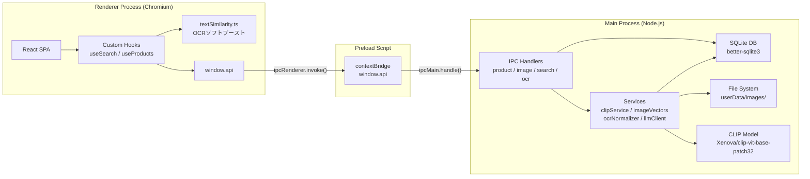
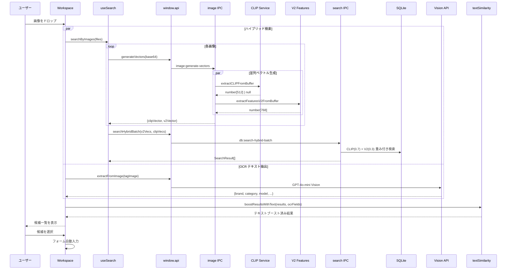
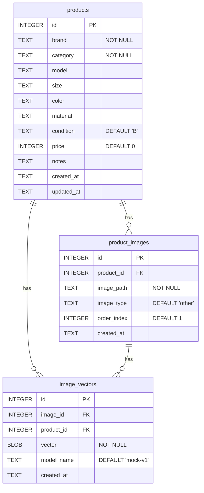
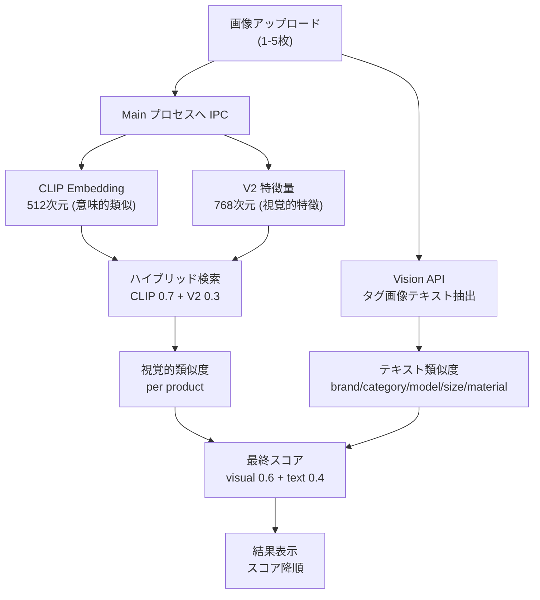
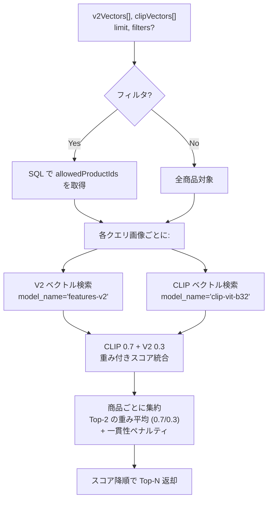
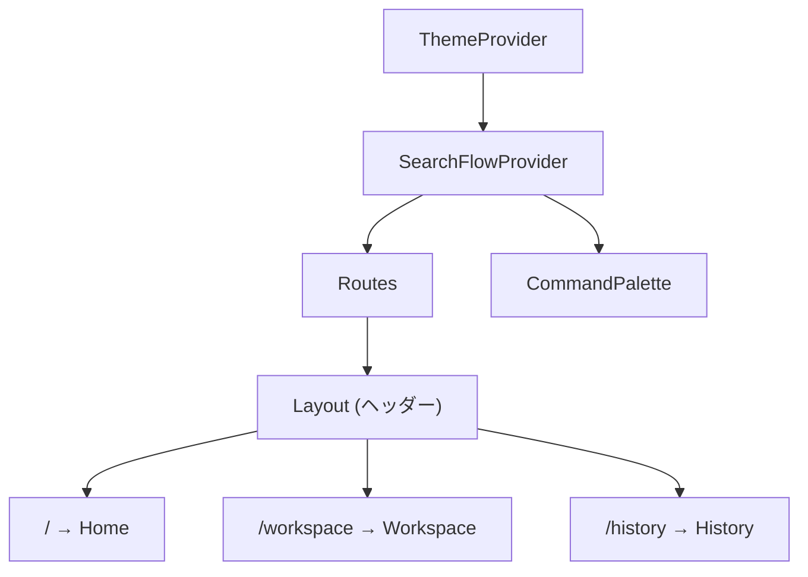
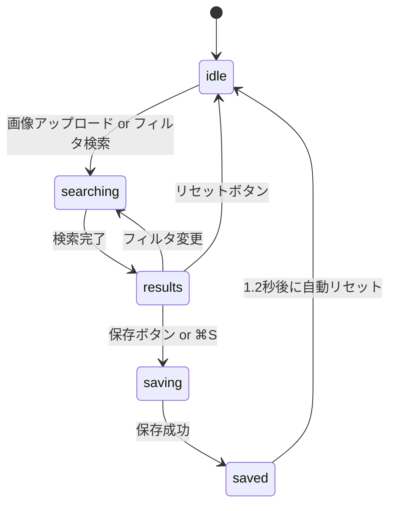
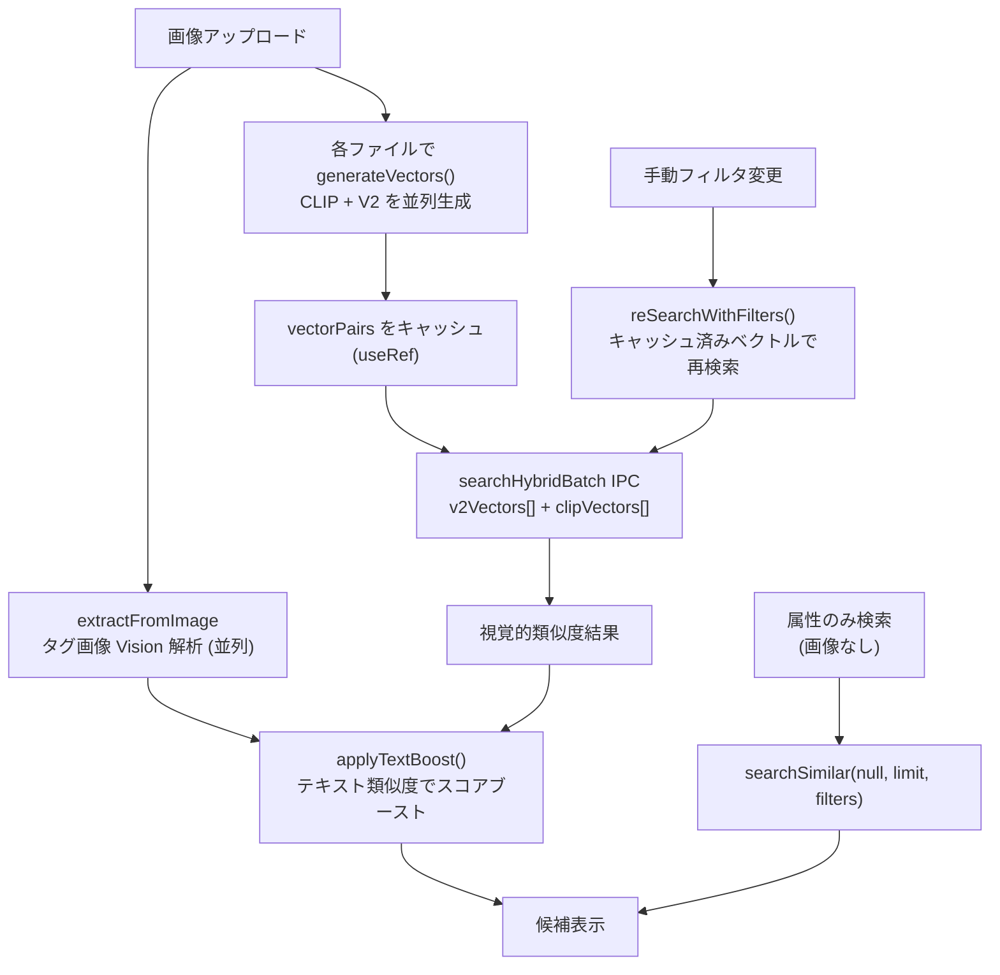
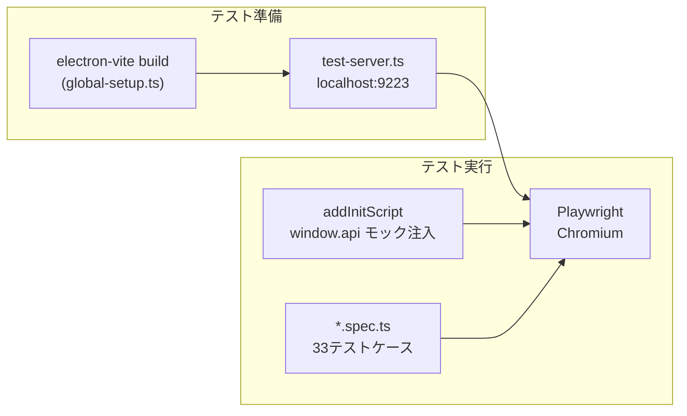

# SS Image Search アーキテクチャドキュメント

> 中古アパレル買取向け画像類似検索デスクトップアプリケーション

対象読者: JavaScript/TypeScript エンジニア

---

## 目次

1. [プロジェクト概要と技術スタック](#1-プロジェクト概要と技術スタック)
2. [ディレクトリ構造とファイルマップ](#2-ディレクトリ構造とファイルマップ)
3. [アーキテクチャ全体像](#3-アーキテクチャ全体像)
4. [データモデルとデータベース](#4-データモデルとデータベース)
5. [画像類似検索パイプライン](#5-画像類似検索パイプライン)
6. [フロントエンド構成](#6-フロントエンド構成)
7. [IPC チャネル仕様](#7-ipc-チャネル仕様)
8. [テストアーキテクチャ](#8-テストアーキテクチャ)

---

## 1. プロジェクト概要と技術スタック

### 目的

中古ブランド品の買取業務において、商品写真をアップロードするだけで過去の類似商品を自動検索し、ブランド名・カテゴリ・価格などのフォーム入力を省力化するデスクトップアプリケーション。CLIP ニューラルネットワーク（512 次元）とハンドクラフト特徴量 V2（768 次元）のハイブリッド検索に加え、タグ画像から Vision API で抽出したテキスト情報によるソフトブーストを組み合わせて高精度な類似検索を実現する。

### 技術スタック

| レイヤー | 技術 | 役割 |
|---|---|---|
| デスクトップフレームワーク | Electron 33 | ネイティブウィンドウ管理、ファイルシステムアクセス |
| ビルドツール | electron-vite 2 + Vite 5 | Main/Preload/Renderer の3ターゲットビルド |
| フロントエンド | React 18 + TypeScript 5 | SPA UI |
| ルーティング | React Router 6 (HashRouter) | クライアントサイドルーティング |
| スタイリング | Tailwind CSS 3 + CSS変数 | ダークモード対応テーマシステム |
| 画像特徴抽出 | @huggingface/transformers + sharp | CLIP 512 次元 + V2 768 次元の embedding |
| OCR/Vision | OpenAI GPT-4o-mini Vision API | タグ画像からブランド・カテゴリ等を抽出 |
| データベース | better-sqlite3 | ローカル SQLite（WAL モード） |
| テスト | Playwright + Vitest | E2E テスト（33ケース）+ ユニットテスト |
| CI | GitHub Actions | macOS 上でのE2Eテスト自動実行 |

### ビルド構成

electron-vite は1つの設定ファイル（`electron.vite.config.ts`）から3つの独立したバンドルを生成する:

| ターゲット | エントリー | 出力先 | 実行環境 |
|---|---|---|---|
| **Main** | `src/main/index.ts` | `out/main/index.js` | Node.js（メインプロセス） |
| **Preload** | `src/preload/index.ts` | `out/preload/index.js` | Node.js（制限付きサンドボックス） |
| **Renderer** | `src/renderer/index.html` | `out/renderer/` | Chromium（ブラウザ環境） |

3ターゲットすべてで `@shared` パスエイリアスが有効になっており、`src/shared/` 内の型定義とユーティリティを Main と Renderer の双方からインポートできる。

---

## 2. ディレクトリ構造とファイルマップ

```
SSImageSearch/
├── src/
│   ├── main/                          # Electron メインプロセス (Node.js)
│   │   ├── index.ts                   #   アプリ起動・ウィンドウ作成
│   │   ├── db/
│   │   │   ├── connection.ts          #   SQLite 接続シングルトン
│   │   │   ├── schema.ts             #   テーブル・インデックス定義
│   │   │   └── seed.ts               #   30商品のサンプルデータ投入
│   │   ├── ipc/
│   │   │   ├── product.ts            #   商品 CRUD の IPC ハンドラー
│   │   │   ├── image.ts              #   画像保存・読取・ベクトル生成の IPC
│   │   │   ├── search.ts             #   ベクトル検索・ハイブリッド検索の IPC
│   │   │   └── ocr.ts                #   OCR正規化・Vision画像解析の IPC
│   │   └── services/
│   │       ├── productService.ts      #   商品の DB 操作ロジック
│   │       ├── imageService.ts        #   画像ファイルの読み書きロジック
│   │       ├── imageVectors.ts        #   V2 768次元特徴量抽出 (Sharp)
│   │       ├── clipService.ts         #   CLIP 512次元 embedding (HuggingFace)
│   │       ├── clipIndexer.ts         #   バックグラウンド CLIP インデクサー
│   │       ├── ocrNormalizer.ts       #   OCRテキスト正規化・Vision画像解析
│   │       └── llmClient.ts           #   OpenAI LLM / Vision API クライアント
│   │
│   ├── preload/
│   │   └── index.ts                   # contextBridge で window.api を公開
│   │
│   ├── renderer/
│   │   ├── index.html                 #   HTML エントリー
│   │   └── src/
│   │       ├── main.tsx               #   React マウント
│   │       ├── App.tsx                #   ルーティング + プロバイダー
│   │       ├── env.d.ts               #   window.api 型定義
│   │       ├── routes/
│   │       │   ├── Home.tsx           #     ダッシュボード
│   │       │   ├── Workspace.tsx      #     買取登録（3ペインレイアウト）
│   │       │   └── History.tsx        #     買取履歴一覧
│   │       ├── components/
│   │       │   ├── Layout.tsx         #     共通ヘッダー + Outlet
│   │       │   ├── CommandPalette.tsx  #     ⌘K コマンドパレット
│   │       │   └── ConfidenceBadge.tsx #    信頼度バッジ
│   │       ├── contexts/
│   │       │   ├── ThemeContext.tsx    #     ライト/ダーク/システムテーマ管理
│   │       │   └── SearchFlowContext.tsx #   検索フロー状態管理
│   │       ├── hooks/
│   │       │   ├── useSearch.ts       #     ハイブリッド検索 + テキストブースト
│   │       │   ├── useProducts.ts     #     商品データ取得
│   │       │   ├── useImages.ts       #     画像ローダー
│   │       │   └── useKeyboard.ts     #     グローバルショートカット
│   │       ├── lib/
│   │       │   ├── embedding.ts       #     Main へのベクトル生成 IPC ラッパー
│   │       │   └── textSimilarity.ts  #     OCRテキストによるスコアブースト
│   │       └── styles/
│   │           └── globals.css        #     Tailwind + テーマ CSS 変数
│   │
│   └── shared/                        # Main/Renderer 共有
│       ├── types.ts                   #   全インターフェース・定数
│       ├── vectors.ts                 #   コサイン類似度・ベクトル直列化
│       └── featureExtraction.ts       #   V2 768次元特徴量計算 (純TypeScript)
│
├── tests/
│   └── e2e/
│       ├── electron-test.ts           #   Playwright カスタムフィクスチャ + モックAPI
│       ├── test-server.ts             #   テスト用 HTTP サーバー
│       ├── global-setup.ts            #   テスト前ビルド
│       ├── home.spec.ts               #   Home 画面テスト
│       ├── workspace-primary.spec.ts  #   Workspace 主要フロー
│       ├── workspace-edge.spec.ts     #   Workspace エッジケース
│       ├── history.spec.ts            #   History 基本テスト
│       ├── history-edge.spec.ts       #   History フィルタ・ページネーション
│       └── keyboard.spec.ts           #   キーボードショートカット
│
├── electron.vite.config.ts            # ビルド設定
├── tailwind.config.js                 # Tailwind 設定
├── playwright.config.ts               # E2E テスト設定
├── package.json
├── tsconfig.json                      # プロジェクト参照ルート
├── tsconfig.node.json                 # Main + Preload + Shared 用
└── tsconfig.web.json                  # Renderer + Shared 用
```

---

## 3. アーキテクチャ全体像

### Electron の3プロセスモデル

Electron アプリは以下の3つの独立した実行コンテキストで構成される:



**セキュリティモデル:** Renderer は `contextIsolation: true` / `nodeIntegration: false` で動作する。Node.js API への直接アクセスはなく、Preload スクリプトが `contextBridge.exposeInMainWorld` で公開した `window.api` オブジェクトのみを通じて Main プロセスと通信する。

### レイヤー間のデータフロー



---

## 4. データモデルとデータベース

### テーブル構成

3つのテーブルが外部キーで連携し、CASCADE 削除で整合性を維持する。



**インデックス:** `product_images.product_id`, `image_vectors.product_id`, `image_vectors.image_id` にそれぞれインデックスが張られている。

### データベース接続管理

`src/main/db/connection.ts` がシングルトンパターンで SQLite 接続を管理する:

```typescript
// connection.ts の核心部分
let db: Database.Database | null = null

export function getDatabase(): Database.Database {
  if (!db) {
    const dbPath = path.join(app.getPath('userData'), 'ssimagesearch.db')
    db = new Database(dbPath)
    db.pragma('journal_mode = WAL')   // 読み書き並行性を改善
    db.pragma('foreign_keys = ON')    // 外部キー制約を強制
  }
  return db
}
```

- **WAL モード**: Write-Ahead Logging により、読み取りと書き込みを同時に実行可能
- **外部キー制約**: `ON` にすることで `image_vectors.image_id` が存在しない `product_images.id` を参照した場合にエラーになる。これにより不正なベクトル挿入を防止する
- **遅延初期化**: `getDatabase()` を初めて呼んだ時点でファイルが作成される

### シードデータ

`src/main/db/seed.ts` がアプリ起動時に初期データを投入する。6ブランド x 5カテゴリ = 30商品で、各商品に2枚のプレースホルダー SVG 画像と対応するベクトルが生成される。

**バージョン管理メカニズム:** `SEED_MODEL` 定数（現在 `mock-v4`）で embedding アルゴリズムのバージョンを追跡する。起動時に `image_vectors` テーブルに該当バージョンのレコードが存在しない場合、全データをクリアして再シードする。アルゴリズム変更時はこのバージョンを上げるだけで自動的にデータが更新される。

```typescript
// seed.ts のバージョンチェック部分
const SEED_MODEL = 'mock-v4'

export function seedDatabase(): void {
  const db = getDatabase()
  const hasCurrentVersion = db
    .prepare('SELECT COUNT(*) as cnt FROM image_vectors WHERE model_name = ?')
    .get(SEED_MODEL) as { cnt: number }

  if (hasCurrentVersion.cnt > 0) return  // 既にシード済み

  // 古いデータをすべて削除して再投入
  db.prepare('DELETE FROM image_vectors').run()
  db.prepare('DELETE FROM product_images').run()
  db.prepare('DELETE FROM products').run()
  // ... トランザクション内で30商品を一括挿入
}
```

---

## 5. 画像類似検索パイプライン

このアプリのコア機能は「画像を入力として類似商品を見つける」ことにある。3つのシグナルを組み合わせたマルチモーダル検索で実現される。

### 5.1 全体フロー



### 5.2 Embedding モデル

画像から2種類の特徴ベクトルを生成し、それぞれの強みを活かしたハイブリッド検索を行う。

#### CLIP（512 次元）— 意味的類似度

`src/main/services/clipService.ts` が `Xenova/clip-vit-base-patch32` モデル（@huggingface/transformers）を使用して画像の意味的な embedding を抽出する。

- **モデル**: `Xenova/clip-vit-base-patch32`（ONNX、約 85MB）
- **入力**: 224x224 RGB（`sharp` でリサイズ、`fit: 'cover'`）
- **出力**: 512 次元、mean pooling + L2 正規化
- **キャッシュ**: `userData/models/` に初回ダウンロード後キャッシュ
- **遅延ロード**: 初回使用時にロード。未ロード時は V2 にフォールバック

#### V2 ハンドクラフト特徴量（768 次元）— 視覚的特徴

`src/shared/featureExtraction.ts` が画像のピクセルデータから手作りの特徴ベクトルを抽出する。Sharp も Canvas も不要な純 TypeScript 実装。

| インデックス | 特徴 | 次元数 |
|---|---|---|
| 0 ~ 191 | 空間カラーグリッド（4x4、セルあたり RGB/HSV 統計） | 192 |
| 192 ~ 407 | HSV 空間ピラミッド（1x1 + 2x2 + 4x4 の色相ヒストグラム） | 216 |
| 408 ~ 551 | 勾配方向ヒストグラム / HOG（4x4 セル x 9 ビン） | 144 |
| 552 ~ 615 | エッジ空間マップ（8x8 ブロックの平均勾配強度） | 64 |
| 616 ~ 743 | テクスチャ LBP（4x4 セル x 8 パターン） | 128 |
| 744 ~ 767 | グローバル統計（色/コントラスト/エッジ密度/色多様性等） | 24 |

**処理**: Main プロセスでは `sharp` で 64x64 にリサイズしてから `extractFeaturesV2FromPixels()` で特徴量を計算。最終的に L2 正規化。

#### ベクトル生成 IPC

`image:generate-vectors` ハンドラーが CLIP と V2 の両方を**並列に**生成して返す:

```typescript
// image.ts — 並列ベクトル生成
const [clipVec, v2Vec] = await Promise.all([
  isCLIPReady() ? extractCLIPFromBuffer(buffer).catch(() => null) : Promise.resolve(null),
  extractFeaturesV2FromBuffer(buffer)
])
return { clipVector: clipVec, v2Vector: v2Vec }
```

### 5.3 ハイブリッド検索（Main 側）

`src/main/ipc/search.ts` が3種類の検索エンドポイントを提供する。

#### db:search-hybrid-batch（メイン検索）

複数画像のハイブリッド検索。Renderer のデフォルト検索パスで使用される。



**一貫性ペナルティ**: 複数画像でそれぞれ異なるベストマッチが出た場合、1枚だけ高スコアの商品はペナルティを受ける。これにより「複数の角度から見ても似ている商品」が優先される。

```typescript
const consistency = top1 > 0 ? top2 / top1 : 0
const adjustedScore = baseScore * (0.8 + 0.2 * consistency)
```

#### db:search-hybrid（単画像ハイブリッド）

1枚の画像から V2 + CLIP でスコアを統合。履歴画面からの類似検索で使用。

#### db:search-similar（レガシー/フィルタ専用）

単一ベクトル検索。フィルタのみの検索（画像なし）で使用。後方互換のために残存。

### 5.4 テキスト類似度によるソフトブースト

`src/renderer/src/lib/textSimilarity.ts` が Vision API で抽出したテキスト情報と保存済み商品メタデータの一致度をスコア化し、視覚的類似度に加算する。

**スコア構成（OCR フィールド重み）:**

| フィールド | 重み | マッチング方式 |
|---|---|---|
| brand | 0.4 | 完全一致 → 1.0 / 部分一致（大小文字無視） → 0.8 |
| category | 0.3 | 完全一致 → 1.0 / 部分一致 → 0.6 |
| model | 0.2 | 完全一致 → 1.0 / 部分一致 → 0.7 |
| size | 0.05 | 完全一致 → 1.0 |
| material | 0.05 | 配列の要素いずれかが部分一致 → 1.0 / 0.7 |

**最終スコア計算:**

```
finalScore = visualSimilarity * 0.6 + textSimilarity * 0.4
```

- OCR フィールドが何もない場合、`textSimilarity = 0` となり視覚スコアのみが使用される（ペナルティなし）
- テキスト一致は「ブースト（加点）」であり「フィルタ（除外）」ではない。これにより候補が不当に排除される問題を防ぐ

### 5.5 Vision API によるタグ画像解析

`src/main/services/ocrNormalizer.ts` の `extractInfoFromImage()` が OpenAI GPT-4o-mini Vision API を使用してタグ画像からブランド名・カテゴリ・サイズ・素材・型番等を構造化 JSON で抽出する。

抽出される情報: `{ brand, category, size, material[], model, other_text[], confidence }`

Workspace では検索と並列で実行され、結果はテキストブーストに使用される。

### 5.6 バックグラウンド CLIP インデクサー

`src/main/services/clipIndexer.ts` が起動時に CLIP モデルのロード後、CLIP ベクトルが未生成の画像に対してバックグラウンドで CLIP ベクトルを生成・保存する。これにより、V2 のみで保存された古い画像もハイブリッド検索の対象になる。

### 5.7 保存時のデュアルベクトル

商品保存時に `image:generate-vectors` を呼び出し、各画像について CLIP と V2 の**両方のベクトルを保存**する:

```typescript
const { clipVector, v2Vector } = await generateVectors(uploadedImages[i].data)
await window.api.saveVector(imageId, productId, v2Vector)
if (clipVector) {
  await window.api.saveVector(imageId, productId, clipVector)
}
```

`model_name` カラム（`'clip-vit-b32'` / `'features-v2'`）でモデルごとに区別して保存。

### 5.8 ベクトルの直列化

ベクトル（`number[]`）は SQLite の BLOB カラムに Float32Array で保存:

```typescript
export function vectorToBuffer(vec: number[]): Buffer {
  const float32 = new Float32Array(vec)
  return Buffer.from(float32.buffer)
}
```

- CLIP: 512 次元 x 4 bytes = **2,048 bytes/ベクトル**
- V2: 768 次元 x 4 bytes = **3,072 bytes/ベクトル**
- 1画像あたり最大 5,120 bytes（両モデル合計）

### 5.9 コサイン類似度

```typescript
export function cosineSimilarity(a: number[], b: number[]): number {
  let dot = 0, normA = 0, normB = 0
  for (let i = 0; i < a.length; i++) {
    dot += a[i] * b[i]
    normA += a[i] * a[i]
    normB += b[i] * b[i]
  }
  if (normA === 0 || normB === 0) return 0
  return dot / (Math.sqrt(normA) * Math.sqrt(normB))
}
```

ベクトルは L2 正規化済みなので `normA ≈ normB ≈ 1` であり、実質的にはドット積と等しい。値の範囲は -1（正反対）から 1（完全一致）。

---

## 6. フロントエンド構成

### 6.1 ルーティングとプロバイダー構成



`src/renderer/src/App.tsx` で以下の順にラップされる:

1. **ThemeProvider**: ライト/ダーク/システムテーマの管理。`localStorage` に永続化し、`<html>` 要素の `dark` クラスでトグル
2. **SearchFlowProvider**: 画像アップロード状態・検索結果・選択候補をルート間で共有
3. **Routes**: `HashRouter` による3ルート。`Layout` コンポーネントが共通ヘッダーを提供し、`<Outlet />` で子ルートを描画

### 6.2 テーマシステム

CSS 変数ベースのテーマシステムを採用:

```
globals.css                      tailwind.config.js
┌─────────────────────┐          ┌───────────────────────┐
│ :root {             │          │ colors: {             │
│   --surface-0:      │◀────────▶│   surface: {          │
│     255 255 255;    │          │     0: rgb(var(       │
│ }                   │          │       --surface-0)    │
│ .dark {             │          │       / <alpha>)      │
│   --surface-0:      │          │   }                   │
│     9 9 11;         │          │ }                     │
│ }                   │          │                       │
└─────────────────────┘          └───────────────────────┘
```

- CSS 変数はスペース区切りの RGB チャネル値（例: `255 255 255`）で定義
- Tailwind の `rgb(var(--name) / <alpha-value>)` 形式で参照し、不透明度修飾子（`bg-surface-0/50` など）に対応
- `ThemeContext` が `document.documentElement.classList.toggle('dark', ...)` でクラスを切り替え

### 6.3 Workspace: 3ペインレイアウト

買取登録の中心画面。3つのペインで構成される:

```
┌──────────────┬──────────────────────────────────┬──────────────────┐
│  左ペイン     │  中央ペイン                       │  右ペイン         │
│  w=260px     │  flex-1                          │  w=380px         │
│              │                                  │                  │
│  画像        │  候補一覧                          │  下書きフォーム    │
│  アップロード │  フィルタバー                      │                  │
│  (最大5枚)   │  リスト/グリッド切替               │  ブランド         │
│              │                                  │  カテゴリ         │
│  ドラッグ&   │  [GUCCI] [バッグ] [全色] [全素材]  │  型番            │
│  ドロップ    │                                  │  サイズ / 色      │
│              │  ┌───────────────────────────┐   │  素材 / 状態      │
│  プレビュー  │  │ 1  GUCCI  バッグ    85%   │   │  価格            │
│              │  │    GG Marmont  ¥85,000    │   │  備考            │
│              │  ├───────────────────────────┤   │                  │
│              │  │ 2  CHANEL バッグ    72%   │   │  ───────         │
│              │  │    マトラッセ  ¥320,000    │   │  [保存] [リセット] │
│              │  └───────────────────────────┘   │                  │
└──────────────┴──────────────────────────────────┴──────────────────┘
```

### 6.4 Workspace のフェーズ管理



| フェーズ | UI状態 |
|---|---|
| `idle` | ドロップゾーン表示。フィルタのみの検索も可能 |
| `searching` | スケルトンカード + スピナー + 進捗率表示 |
| `results` | 候補一覧。数字キー (1-9) で選択可能。フィルタバー操作で即座に再検索 |
| `saving` | 保存中スピナー |
| `saved` | 完了チェックマーク。1.2秒後に自動で idle に戻る |

### 6.5 検索フロー詳細

`useSearch` フックが検索ロジック全体を管理する:



**ベクトルキャッシュ:** 初回の画像アップロード時に計算した CLIP + V2 のベクトルペアを `useRef` で保持する。フィルタ変更時は `reSearchWithFilters()` がキャッシュ済みのベクトルで `searchHybridBatch` を再実行するため、重いベクトル生成をスキップして即座にフィルタ結果を反映できる。

**OCR テキストブースト:** 画像検索と並列で Vision API がタグ画像を解析し、ブランド名・カテゴリ等を抽出する。この結果は**ハードフィルタ（除外）ではなくソフトブースト（加点）**として使われ、テキスト一致する商品の類似度スコアを引き上げる。これにより、同じ画像が OCR の表記ゆれで除外される問題を防ぐ。

### 6.6 カスタムフック一覧

| フック | ファイル | 責務 |
|---|---|---|
| `useSearch` | `hooks/useSearch.ts` | ハイブリッド検索・ベクトルキャッシュ・テキストブースト・フィルタ再検索 |
| `useProducts` | `hooks/useProducts.ts` | 商品一覧取得（フィルタ・ページネーション対応） |
| `useRecentProducts` | `hooks/useProducts.ts` | 直近N件の商品取得（Home 画面用） |
| `useProduct` | `hooks/useProducts.ts` | 単一商品 + 画像取得 |
| `useImageLoader` | `hooks/useImages.ts` | 画像パスから base64 データを読み込み |
| `useGlobalShortcuts` | `hooks/useKeyboard.ts` | ⌘N（Workspace）/ ⌘H（History）ショートカット |

### 6.7 キーボード操作

| ショートカット | 場所 | 動作 |
|---|---|---|
| ⌘N | グローバル | Workspace に遷移 |
| ⌘H | グローバル | History に遷移 |
| ⌘K | グローバル | コマンドパレットを開く |
| ⌘S | Workspace | 商品を保存 |
| 1-9 | Workspace（候補表示中） | 候補を数字で選択 |
| Escape | コマンドパレット / History詳細 | パネルを閉じる |

---

## 7. IPC チャネル仕様

全ての IPC 通信は `ipcRenderer.invoke()` / `ipcMain.handle()` パターン（非同期 Request-Response）で実装されている。

### チャネル一覧

**検索系:**

| チャネル名 | 引数 | 戻り値 | 説明 |
|---|---|---|---|
| `db:search-hybrid-batch` | `v2Vectors: number[][], clipVectors: (number[]\|null)[], limit?, filters?` | `SearchResult[]` | **主要検索パス**。複数画像のハイブリッド検索 |
| `db:search-hybrid` | `v2Vector: number[]\|null, clipVector: number[]\|null, limit?, filters?` | `SearchResult[]` | 単画像ハイブリッド検索 |
| `db:search-similar` | `queryVector: number[]\|null, limit?, filters?` | `SearchResult[]` | レガシー単一ベクトル検索 / フィルタ専用 |
| `db:save-vector` | `imageId: number, productId: number, vector: number[]` | `void` | ベクトル保存（model_name は次元数から自動判定） |
| `db:get-all-vectors` | なし | `Array<{id, image_id, product_id, vector, model_name}>` | 全ベクトル取得 |

**画像系:**

| チャネル名 | 引数 | 戻り値 | 説明 |
|---|---|---|---|
| `image:generate-vectors` | `imageBase64: string` | `{clipVector: number[]\|null, v2Vector: number[]}` | **主要パス**。CLIP + V2 を並列生成 |
| `image:generate-vector` | `imageBase64: string` | `{vector, modelName, dim}` | レガシー。CLIP 優先、V2 フォールバック |
| `image:save` | `productId: number, images: Array<{data, type, index}>` | `Array<{path, type, index, imageId}>` | 画像ファイル保存 |
| `image:read` | `imagePath: string` | `string\|null` (base64 Data URL) | 画像読み込み |

**商品系:**

| チャネル名 | 引数 | 戻り値 | 説明 |
|---|---|---|---|
| `db:get-products` | `filter?: ProductFilter` | `{products: Product[], total: number}` | 商品一覧 |
| `db:get-recent-products` | `limit?: number` | `Product[]` | 直近 N 件 |
| `db:get-product` | `id: number` | `{product, images}\|null` | 単一商品詳細 |
| `db:save-product` | `data: ProductFormData, imageRecords: ...` | `number` (productId) | 商品保存 |
| `db:get-product-count` | なし | `number` | 商品数 |

**OCR / Vision 系:**

| チャネル名 | 引数 | 戻り値 | 説明 |
|---|---|---|---|
| `ocr:extract-from-image` | `imageBase64: string` | `{brand, category, size, material[], model, other_text[], confidence}` | Vision API で画像解析 |
| `ocr:normalize` | `rawOcrText: string, options?` | `OcrNormalizedResult` | 生 OCR テキストを LLM で正規化 |
| `clip:status` | なし | `{ready: boolean, error?: string}` | CLIP モデルの読み込み状態 |

### Preload ブリッジ

`src/preload/index.ts` が `contextBridge.exposeInMainWorld('api', api)` で全チャネルを `window.api` として公開する:

```typescript
const api = {
  // 検索
  searchHybridBatch: (v2Vecs, clipVecs, limit?, filters?) =>
    ipcRenderer.invoke('db:search-hybrid-batch', v2Vecs, clipVecs, limit, filters),
  searchHybrid: (v2Vec, clipVec, limit?, filters?) =>
    ipcRenderer.invoke('db:search-hybrid', v2Vec, clipVec, limit, filters),
  searchSimilar: (vector, limit?, filters?) =>
    ipcRenderer.invoke('db:search-similar', vector, limit, filters),

  // ベクトル生成
  generateVectors: (imageBase64) =>
    ipcRenderer.invoke('image:generate-vectors', imageBase64),

  // OCR / Vision
  extractFromImage: (imageBase64) =>
    ipcRenderer.invoke('ocr:extract-from-image', imageBase64),
  normalizeOcr: (rawOcrText, options?) =>
    ipcRenderer.invoke('ocr:normalize', rawOcrText, options),
  clipStatus: () => ipcRenderer.invoke('clip:status'),

  // ... CRUD / 画像操作 (計17メソッド)
}

contextBridge.exposeInMainWorld('api', api)
export type ElectronAPI = typeof api
```

Renderer 側では `src/renderer/src/env.d.ts` で `window.api` の型を宣言:

```typescript
interface Window {
  api: import('../../preload/index').ElectronAPI
}
```

### 型定義

全インターフェースは `src/shared/types.ts` に集約されており、Main と Renderer の双方から `@shared/types` でインポートする:

| 型名 | 用途 |
|---|---|
| `Product` | 商品テーブル行 |
| `ProductImage` | 画像テーブル行 |
| `ImageVector` | ベクトルテーブル行 |
| `SearchResult` | 検索結果（product + images + similarity + matchReasons + confidence） |
| `ProductFormData` | フォーム入力データ |
| `SearchFilter` | 検索フィルタ（brand, category, color, material） |
| `ProductFilter` | 商品一覧フィルタ（brand, category, page, limit） |
| `UploadedImage` | アップロード画像（base64 data, name, type, index） |
| `OcrFields` | OCR 抽出フィールド（brand, category, model, size, material）— Renderer 側 |
| `VectorsResult` | デュアルベクトル結果（clipVector \| null, v2Vector）— Renderer 側 |
| `OcrNormalizeOptions` | OCR 正規化オプション |

---

## 8. テストアーキテクチャ

### テスト戦略

E2E テストは Playwright を使用し、**ビルド済み Renderer を HTTP 配信してブラウザで実行する**方式を採用している。Electron プロセスは起動せず、`window.api` をモックに差し替えることで、フロントエンドの UI/UX を独立してテストする。



### テスト実行フロー

1. **グローバルセットアップ** (`tests/e2e/global-setup.ts`): `electron-vite build` を実行してアプリをビルド
2. **テストサーバー** (`tests/e2e/test-server.ts`): `out/renderer/` を `localhost:9223` で配信。SPA フォールバック対応
3. **カスタムフィクスチャ** (`tests/e2e/electron-test.ts`):
   - `appPage`: `page.addInitScript()` で `window.api` のモック実装を注入し、ページを読み込む
   - `testImagePath`: テスト用の一時 PNG ファイルを生成・クリーンアップ

### モック API 注入パターン

```typescript
// electron-test.ts のモック注入（抜粋）
function buildMockApiScript(): string {
  return `
    window.api = {
      getProducts: async (filter) => { /* ... フィルタ付き商品返却 */ },
      searchSimilar: async (vector, limit) => window.__mockSearchResults,
      searchHybrid: async (v2, clip, limit) => window.__mockSearchResults,
      searchHybridBatch: async (v2s, clips, limit) => window.__mockSearchResults,
      generateVectors: async (base64) => ({
        clipVector: new Array(512).fill(0),
        v2Vector: new Array(768).fill(0)
      }),
      extractFromImage: async () => ({
        brand: null, category: null, size: null,
        material: null, model: null, other_text: [], confidence: 0
      }),
      clipStatus: async () => ({ ready: true }),
      // ... 全17メソッド
    };
  `
}

export const test = base.extend<TestFixtures>({
  appPage: async ({ page, baseURL }, use) => {
    await page.addInitScript(buildMockApiScript())
    await page.goto(baseURL || 'http://localhost:9223')
    await page.locator('[data-testid="app-root"]').waitFor(...)
    await use(page)
  }
})
```

この方式により:
- **Electron 不要**: CI 環境で Electron バイナリをインストールする必要がない
- **高速**: ネイティブウィンドウ生成のオーバーヘッドがない
- **確定的**: モックデータが固定なのでフレーキーテストが発生しにくい

### テストケース構成

| ファイル | ケース数 | テスト内容 |
|---|---|---|
| `home.spec.ts` | 3 | ホーム画面表示、ナビゲーション |
| `workspace-primary.spec.ts` | 6 | 画像アップロード → 候補選択 → 編集 → 保存の通しフロー |
| `workspace-edge.spec.ts` | 6 | 必須項目バリデーション、リセット、複数画像、自動リセット |
| `history.spec.ts` | 3 | 一覧表示、詳細パネル開閉 |
| `history-edge.spec.ts` | 7 | フィルタリング、ページネーション、トグル |
| `keyboard.spec.ts` | 8 | ⌘N/H/K ショートカット、コマンドパレット、数字キー選択 |
| **合計** | **33** | |

### CI 設定

`.github/workflows/e2e.yml` で `push` / `pull_request` 時に macOS 上でテストを実行:

```yaml
jobs:
  e2e:
    runs-on: macos-latest
    steps:
      - uses: actions/checkout@v4
      - uses: actions/setup-node@v4
        with: { node-version: 20, cache: npm }
      - run: npm ci
      - run: npm run test:e2e
```

失敗時はスクリーンショット・トレース・動画を `test-results/` にアーティファクトとして保存する。
